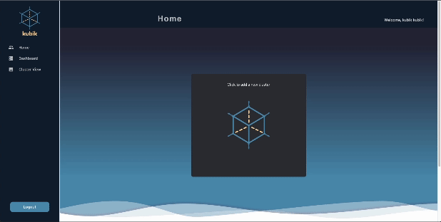
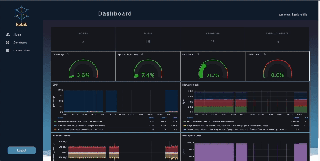
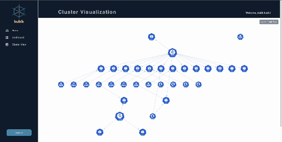

<div align='center'>

[](https://www.javascript.com/)


[](https://www.docker.com/)
[](https://kubernetes.io/)
[](https://prometheus.io/)
[](https://grafana.com/)
[](https://helm.sh/)
[](https://www.mongodb.com/)
[](https://mui.com/)


</div>

# kubik

## Welcome to <b>kubik</b>!

kubik is an open-source Kubernetes visualization dashboard designed to give you an intuitive and efficient way to visualize the health and structure of your local Kubernetes clusters. kubik transforms the complex Kubernetes environment into an easy-to-navigate and understand interface, reducing the learning curve for new users. It displays the information you need at a glance, allowing you to focus on key metrics and potential issues.

## Features

### Google OAuth 2.0


Secure your Kubernetes cluster health monitoring with the power of Google Authentication and log in seamlessly using your Google credentials. This standardized approach to user access provides a robust layer of security for your project and cluster data.

### Adding Clusters



Expand your monitoring capabilities by connecting and adding Kubernetes clusters to your centralized health tracking system. Streamline the process of integrating clusters, allowing you to keep an eye on multiple environments from a single platform.

### Metrics Dashboard



Experience comprehensive insights into the health and performance of your Kubernetes cluster through a responsive dashboard. Monitor key metrics such as CPU utilization, RAM usage, disk space, memory, and network performance in real-time.

### Cluster Visualization



Gain a deeper understanding of your Kubernetes ecosystem with an interactive cluster graph representation. Explore the intricate relationships and complex interdependencies among nodes, pods, services, and deployments in a visually engaging manner.

## Cluster Setup

1. Set up minikube, a local Kubernetes to get started with testing kubik by following the minikube [documentation](https://minikube.sigs.k8s.io/docs/start/).

2. Install and configure Docker by following the Docker [documentation](https://www.docker.com/get-started/).

3. Create an example yaml file named "webapp-deploymment.yaml" to use a simple Nginx web server for the webapp with the following content:

webapp-deploymment.yaml:

```yaml
apiVersion: apps/v1
kind: Deployment
metadata:
  name: webapp-deployment
spec:
  replicas: 3
  selector:
    matchLabels:
      app: webapp
  template:
    metadata:
      labels:
        app: webapp
    spec:
      containers:
        - name: webapp-container
          image: nginx:latest
          ports:
            - containerPort: 80
```

4. Run the following terminal command to deploy the web server.

```bash
kubectl apply -f webapp-deployment.yaml
```

5. Create an example yaml file named "webapp-service.yaml" to create a service to expose the deployment with the following content:

webapp-service.yaml:

```yaml
apiVersion: v1
kind: Service
metadata:
  name: webapp-service
spec:
  selector:
    app: webapp
  ports:
    - protocol: TCP
      port: 80
      targetPort: 80
  type: NodePort
```

6. Run the following terminal command to expose the web application's service.

```bash
kubectl apply -f webapp-service.yaml
```

7. Update the "webapp-service.yaml" file to include Prommetheus annotations. This allows your application to be discovered and scraped for metrics.

webapp-service.yaml:

```yaml
apiVersion: apps/v1
kind: Deployment
metadata:
  name: webapp-deployment
  annotations:
    prometheus.io/scrape: 'true'
    prometheus.io/port: '80'
spec:
  replicas: 2
  selector:
    matchLabels:
      app: webapp
  template:
    metadata:
      labels:
        app: webapp
    spec:
      containers:
        - name: webapp-container
          image: nginx:latest
          ports:
            - containerPort: 80
```

8. Run the following terminal command to apply the changes.

```bash
kubectl apply -f webapp-deployment.yaml
```

9. Install helm by following the Helm [documentation](https://helm.sh/docs/intro/install/).

## Prometheus/Grafana Setup

1. Deploy the Prometheus monitoring and alerting toolkit by running the following terminal command:

```bash
helm install prometheus prometheus-community/prometheus
```

2. Forward the Prometheus service from the 'default' namespace within your Kubernetes cluster to port 9090 on your local machine by executing the following terminal command:

```bash
kubectl port-forward svc/prometheus-server 9090:80 -n default
```

3. Install and log into Grafana by following the Grafana [documentation](https://grafana.com/docs/grafana/latest/setup-grafana/installation/).

4. Configure your grafana.ini by following the Grafana [documentation](https://grafana.com/docs/grafana/latest/setup-grafana/configure-grafana/).

5. Under the [security] section, change "allow_embedding" from "false" to "true". Restart Grafana.

## App Launch

1. Clone the repo.

2. Set up the .env file by using the .template.env file.

3. Install the dependencies by running the following command:

```bash
npm install
```

4. Run the application by running the following commands:

```bash
npm run start
```

5. Visit `http://localhost:[PORT]` in your browser.

## Contribution

Any contributions are always welcomed and appreciated!

- Fork the project.
- Create your feature branch.
- Create a pull request detailing the changes you would like to introduce.
- Create a new issue on GitHub.

## Our Team

- Branden Chi [GitHub](https://github.com/brandenchi) | [LinkedIn]()
- Felipe Varela [GitHub](https://github.com/var-ela) | [LinkedIn](https://github.com/var-ela)
- Sung Ku Kang [GitHub](https://github.com/sung-kang) | [LinkedIn](https://github.com/sung-kang)
- Yvonne Tram [GitHub](https://github.com/yqtram) | [LinkedIn](https://github.com/yqtram)
